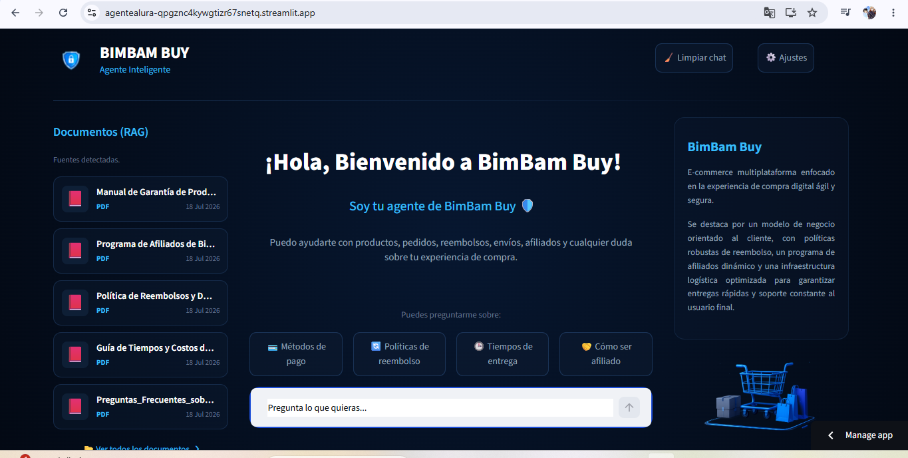
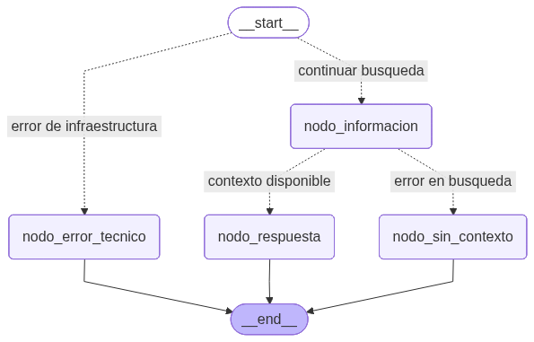
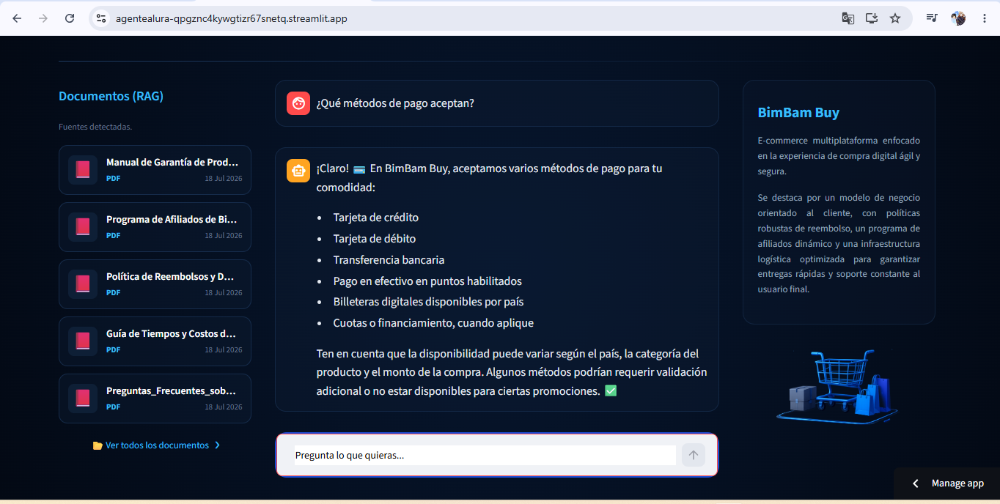
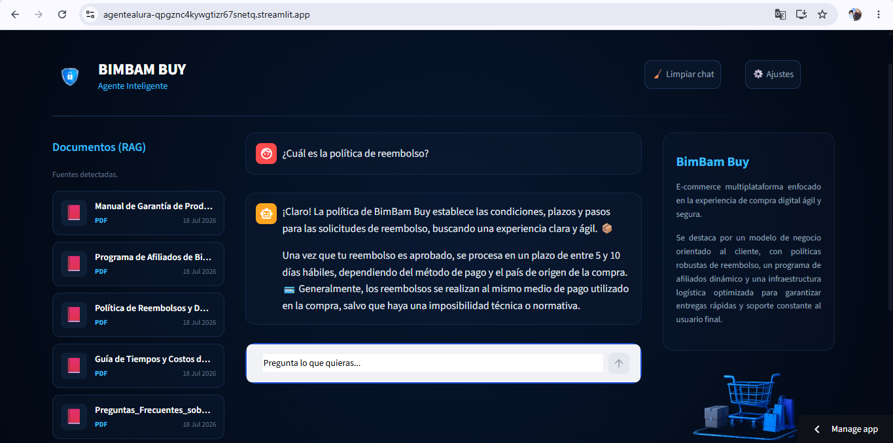
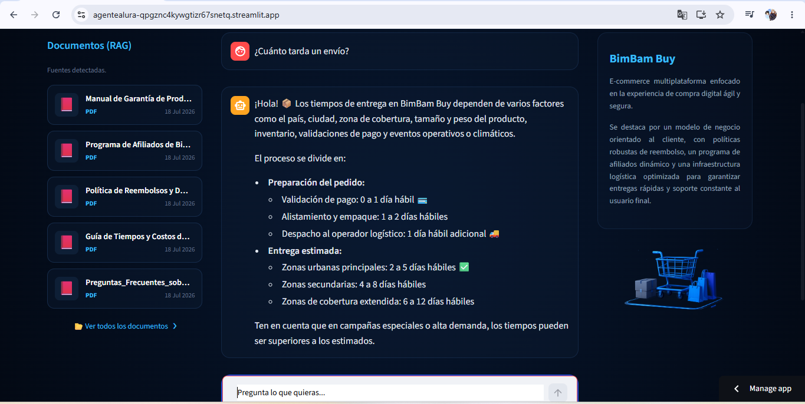

# 🛡️ Agente Inteligente con RAG y LangGraph - BimBam Buy (Agente Alura)

### **`Link de la Aplicación (Deploy):`** https://agentealura-qpgznc4kywgtizr67snetq.streamlit.app/

### Deploy de App:



## 📖 Descripción General

Este proyecto consiste en el desarrollo de un aagente inteligente en Python para responder consultas relacionadas con la plataforma de comercio electrónico BimBam Buy.

El proyecto implementa una arquitectura **Retrieval-Augmented Generation (RAG)**, que permite combinar la capacidad de generación de lenguaje de **Google Gemini** con una base de conocimiento propia construida a partir de documentos PDF y archivos Excel.

Para garantizar respuestas precisas y reducir las alucinaciones del modelo, el agente recupera primero información relevante desde una base vectorial utilizando **FAISS** y posteriormente genera respuestas únicamente con el contexto encontrado.

Adicionalmente, el flujo del agente es orquestado mediante **LangGraph**, permitiendo controlar la validación del sistema, la búsqueda de información, el manejo de errores y la generación de respuestas mediante una máquina de estados.

---

# 🏗️ Arquitectura de la Solución

La solución implementa una arquitectura **Retrieval-Augmented Generation (RAG)**, cuyo objetivo es enriquecer las respuestas del modelo de lenguaje mediante la recuperación de información desde una base de conocimiento propia antes de generar una respuesta.

El flujo general de la arquitectura es el siguiente:

```text
                 Usuario
                    │
                    ▼
          Interfaz Streamlit
                    │
                    ▼
         Consulta del usuario
                    │
                    ▼
      Búsqueda semántica (FAISS)
                    │
                    ▼
 Recuperación de documentos relevantes
                    │
                    ▼
    Contexto + Pregunta del usuario
                    │
                    ▼
          Google Gemini (LLM)
                    │
                    ▼
          Respuesta al usuario
```

La arquitectura RAG está compuesta por los siguientes elementos:

| Componente | Descripción |
|------------|------------|
| **Documentos** | PDFs y archivos Excel ubicados en `docs/`. |
| **Embeddings** | Generados mediante `GoogleGenerativeAIEmbeddings`. |
| **Base vectorial** | Implementada con FAISS. |
| **Retriever** | Recupera los fragmentos(chunk). |
| **LLM** | Google Gemini genera la respuesta. |
| **Interfaz** | Aplicación desarrollada en Streamlit. |

---

# 🔄 Orquestación del Flujo con LangGraph

Aunque la arquitectura principal del sistema es **RAG**, el comportamiento del agente se encuentra orquestado mediante **LangGraph**, implementando una máquina de estados que controla el flujo de ejecución.

LangGraph se encarga de:

- Validar que el Retriever esté disponible.
- Ejecutar la búsqueda semántica.
- Determinar si existe contexto suficiente.
- Manejar errores de infraestructura.
- Generar respuestas.
- Finalizar correctamente el flujo.

---

# 🧠 Grafo del Agente



El grafo representa el flujo completo del agente.

### 1. `START`

Punto inicial del flujo.

Antes de realizar cualquier búsqueda, se verifica que el sistema de recuperación esté disponible.

Se ejecuta:

```python
validar_retriever()
```

---

### 2. Validación del Retriever

Existen dos posibles caminos:

#### ✅ Retriever disponible

```
continuar busqueda
```

Se dirige hacia:

```
nodo_informacion
```

#### ❌ Error técnico

```
error de infraestructura
```

Se dirige hacia:

```
nodo_error_tecnico
```

---

### 3. `nodo_informacion`

Ejecuta:

```python
buscar_informacion()
```

Este nodo:

- consulta FAISS;
- recupera documentos relevantes;
- extrae el contexto necesario.

Configuración utilizada:

```python
search_type="similarity_score_threshold"

score_threshold = 0.3

k = 4
```

---

### 4. Decisión del flujo

Se evalúa si existe contexto relevante:

```python
determinar_siguiente_paso()
```

Posibles resultados:

#### Existe contexto

```
contexto disponible
```

→ `nodo_respuesta`

#### No existe contexto

```
error en busqueda
```

→ `nodo_sin_contexto`

---

### 5. `nodo_respuesta`

Ejecuta:

```python
generar_respuesta()
```

Se utiliza Google Gemini junto con un prompt diseñado para:

- responder únicamente con el contexto;
- evitar alucinaciones;
- mantener un tono profesional;
- generar respuestas breves y amigables.

---

### 6. `nodo_sin_contexto`

Se ejecuta cuando no existe información suficiente en los documentos.

El agente informa al usuario que no encontró información relacionada.

---

### 7. `nodo_error_tecnico`

Se ejecuta cuando el sistema no puede inicializar el Retriever o la base vectorial.

---

### 8. `END`

Finaliza la ejecución del flujo.

---

# 📂 Estructura del Proyecto

```text
agente_alura/
│
├── assets/
│   ├── carrito.png
│   ├── logo.png
│   └── grafo_flujo.png
│
├── src/
│   ├── docs/
│   ├── faiss_index/
│   ├── agent.py
│   ├── database.py
│   ├── graph.py
│   └── app.py
│
├── .env
├── requirements.txt
└── README.md

```

---

# 🔍 Funcionamiento del Sistema RAG

## 1. Carga de documentos

El sistema procesa automáticamente los archivos almacenados en:

```text
docs/
```

Tipos soportados:

- PDF
- XLSX
- XLS

---

## 2. División en fragmentos

Los documentos se dividen utilizando:

```python
RecursiveCharacterTextSplitter
```

Configuración:

```python
chunk_size = 2500
chunk_overlap = 250
```

---

## 3. Generación de embeddings

Cada fragmento se transforma en vectores utilizando:

```python
GoogleGenerativeAIEmbeddings
```

Modelo:

```text
gemini-embedding-001
```

---

## 4. Almacenamiento vectorial

Los vectores son almacenados en:

```text
FAISS
```

Si existe:

```text
faiss_index/
```

se carga automáticamente.

En caso contrario se genera desde cero.

---

## 5. Recuperación semántica

El Retriever busca los documentos más relevantes mediante similitud vectorial.

---

## 6. Generación de respuestas

Gemini recibe:

- pregunta del usuario;
- contexto recuperado.

Y genera una respuesta basada exclusivamente en dicha información.

---

# 🛠️ Tecnologías Utilizadas

| Tecnología | Uso |
|------------|------|
| Python | Lenguaje principal |
| Streamlit | Interfaz gráfica |
| LangChain | Integración LLM |
| LangGraph | Orquestación(Grafo) |
| Google Gemini | Modelo de lenguaje(LLM principal) |
| Gemini Embeddings | Embeddings (LLM Embeddings) |
| FAISS | Base de datos vectorial |
| PyMuPDF | Lectura de PDF |
| Pandas | Lectura de Excel |
| Dotenv | Variables de entorno |

---

# ⚙️ Instalación

Clonar el repositorio:

```bash
git clone https://github.com/Ivan-Arlex/AgenteAlura.git
```

Entrar al proyecto:

```bash
cd agente_alura
```

Crear entorno virtual:

```bash
python -m venv venv
```

Activar entorno:

Windows:

```bash
venv\Scripts\activate
```

Linux/Mac:

```bash
source venv/bin/activate
```

Instalar dependencias:

```bash
pip install -r requirements.txt
```

---

# 🔑 Variables de Entorno

Crear un archivo `.env`:

```env
GEMINI_API_KEY=TU_API_KEY

MODELO_GEMINI=gemini-2.5-flash

MODELO_EMBEDDING=gemini-embedding-001

GENERAR_GRAFO="True" (debe ponerse False si la imagen ya fue generada)
```

---

# ▶️ Ejecución

Una vez instaladas las dependencias y configuradas las variables de entorno, ejecuta la aplicación desde la **carpeta raíz del proyecto** con el siguiente comando:

```bash
streamlit run src/app.py
```

Si todo está configurado correctamente, Streamlit iniciará un servidor local y abrirá automáticamente la aplicación en el navegador. En caso de no abrirse automáticamente, la interfaz estará disponible en:

```text
http://localhost:8501
```
---

# 💬 Ejemplos de Preguntas

- ¿Qué métodos de pago aceptan?
- ¿Cuáles son los tiempos de entrega?
- ¿Cómo solicitar un reembolso?
- ¿Cómo funciona el programa de afiliados?
- ¿Cuál es la política de reembolso?

---

# 🤖 Ejemplos de Respuestas

### Pregunta

> ¿Qué métodos de pago aceptan?

### Respuesta

```text
¡Claro! 💳 En BimBam Buy, aceptamos varios métodos de pago para tu comodidad:

• Tarjeta de crédito
• Tarjeta de débito
• Transferencia bancaria
• Pago en efectivo en puntos habilitados
• Billeteras digitales disponibles por país
• Cuotas o financiamiento, cuando aplique

Ten en cuenta que la disponibilidad puede variar según el país, la categoría del producto y el monto de la compra. Algunos métodos podrían requerir validación adicional o no estar disponibles para ciertas promociones. ✅
```

---

### Pregunta

> ¿Cuál es la política de reembolso?

### Respuesta

```text
¡Claro! La política de BimBam Buy establece las condiciones, plazos y pasos para las solicitudes de reembolso, buscando una experiencia clara y ágil. 📦

Una vez que tu reembolso es aprobado, se procesa en un plazo de entre 5 y 10 días hábiles, dependiendo del método de pago y el país de origen de la compra. 💳 Generalmente, los reembolsos se realizan al mismo medio de pago utilizado en la compra, salvo que haya una imposibilidad técnica o normativa.
```

---

### Pregunta

> ¿Cuánto tarda un envío?

### Respuesta

```text
¡Hola! 📦 Los tiempos de entrega en BimBam Buy dependen de varios factores como el país, ciudad, zona de cobertura, tamaño y peso del producto, inventario, validaciones de pago y eventos operativos o climáticos.

El proceso se divide en:

• Preparación del pedido:

◦ Validación de pago: 0 a 1 día hábil 💳
◦ Alistamiento y empaque: 1 a 2 días hábiles
◦ Despacho al operador logístico: 1 día hábil adicional 🚚

• Entrega estimada:

◦ Zonas urbanas principales: 2 a 5 días hábiles ✅
◦ Zonas secundarias: 4 a 8 días hábiles
◦ Zonas de cobertura extendida: 6 a 12 días hábiles

Ten en cuenta que en campañas especiales o alta demanda, los tiempos pueden ser superiores a los estimados.
``` 

---

La aplicación principal se implementa en:

```python
app.py
```

La interfaz utiliza:

```python
procesar_consulta()
```

para enviar preguntas al grafo y obtener respuestas. :

---

# 🧩 Patrones de Diseño Implementados

## Singleton

El grafo compilado se crea una única vez:

```python
obtener_grafo()
```

Esto evita recompilar el workflow en cada consulta.

```python
get_vectorstores()
get_retriever()
```

Con `get_vectorstores()` y `get_retriever()` se evita que cree un objeto nuevo por cada consulta que realize el usuario.

---

# ✨ Características del Proyecto

✅ Arquitectura RAG  
✅ Búsqueda semántica  
✅ Embeddings con Gemini  
✅ FAISS  
✅ LangGraph  
✅ Manejo de errores  
✅ Control del flujo conversacional  
✅ Interfaz con Streamlit  
✅ Minimización de alucinaciones  
✅ Respuestas basadas únicamente en documentos  

---

# 🧑🏽‍💻 Autor: Iván Arlex Buenaventura Riascos 

💻 Proyecto desarrollado para implementar un agente inteligente basado en:

**RAG + FAISS + Google Gemini + LangChain + LangGraph + Streamlit**🤖💻.